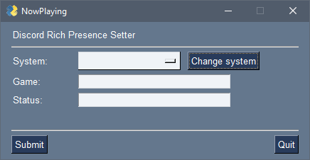

# Now Playing

*Now Playing* is a simple companion application for creating custom Discord rich presence text.

This is a toy application, so I make no promises about its viability, sustailabilty, compatabaility, longevity, or for 
that matter any details regarding my sanity. If, after all that, you still want to mess with this, then have a blast 
and good luck!

## Installation

1. Clone the repo. 
2. Install requirements: `pip install -r requirements.txt`
3. Make a copy of the `discord-ids.json.example` file.
4. Edit the file with your own unique Application IDs as provided by Discord.
5. Run and profit.

## Theory of Operations

You will need to create a new application via the Discord Developer interface for each 'System' instance you want 
listed within the program. You can access the developer portal [here](https://discord.com/developers/applications).
You will then need to capture to *Application ID* for your new application, and paste is as a new entry into the
`discord-ids.json` file (see the `discord-ids.json.example` file for an example of the structure).

**Important Note:** You must run this application on the system where your active Discord client is running! (This
might be obvious to some, but I feel it is worth stating for absolute clarity.) The 
[pypresence](https://github.com/qwertyquerty/pypresence) module this toy is based around requires a running Discord
instance in order to function.

## License

This project is under the What the Fuck Public License. See [LICENSE](LICENSE) for details.